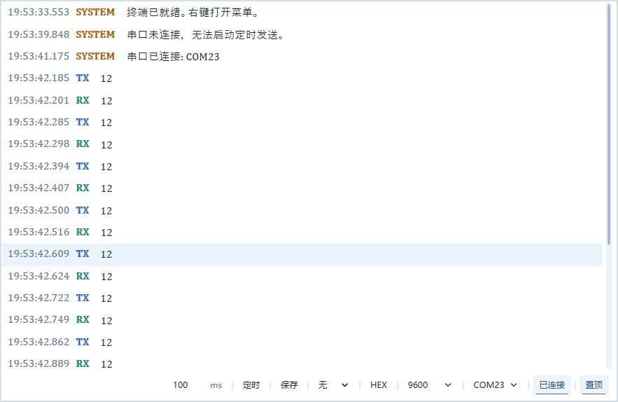
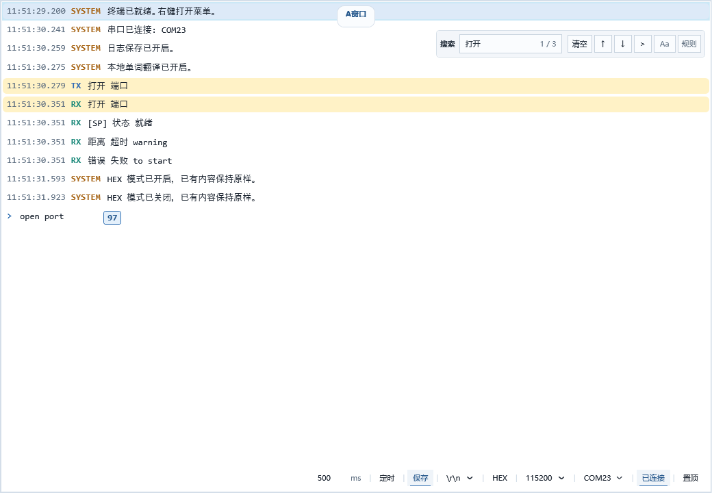
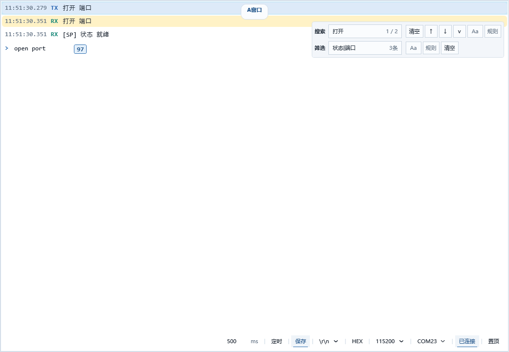
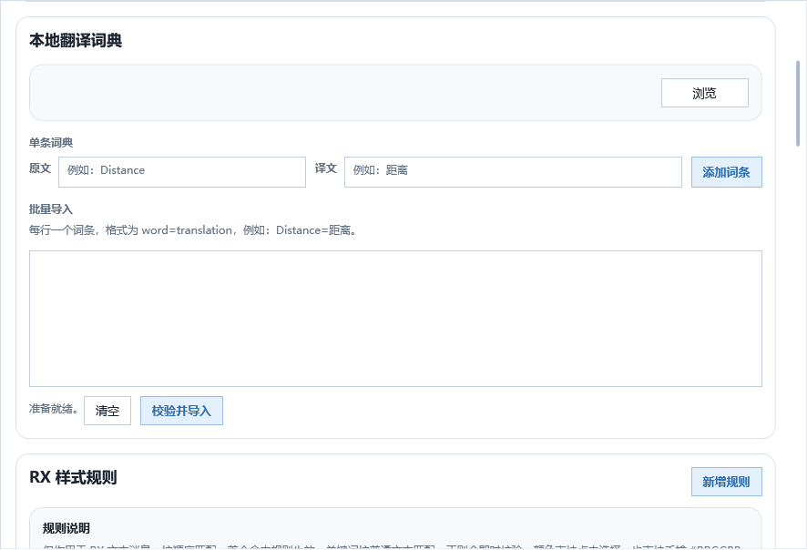
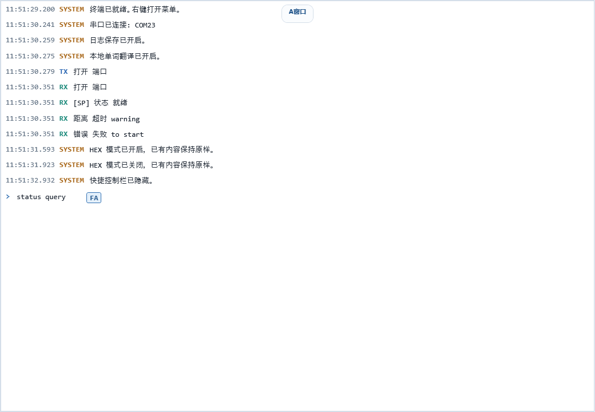
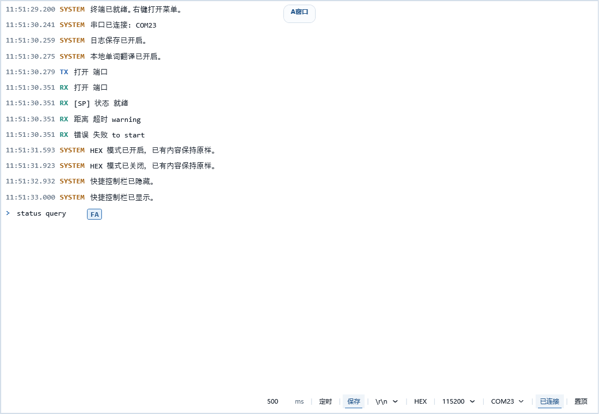
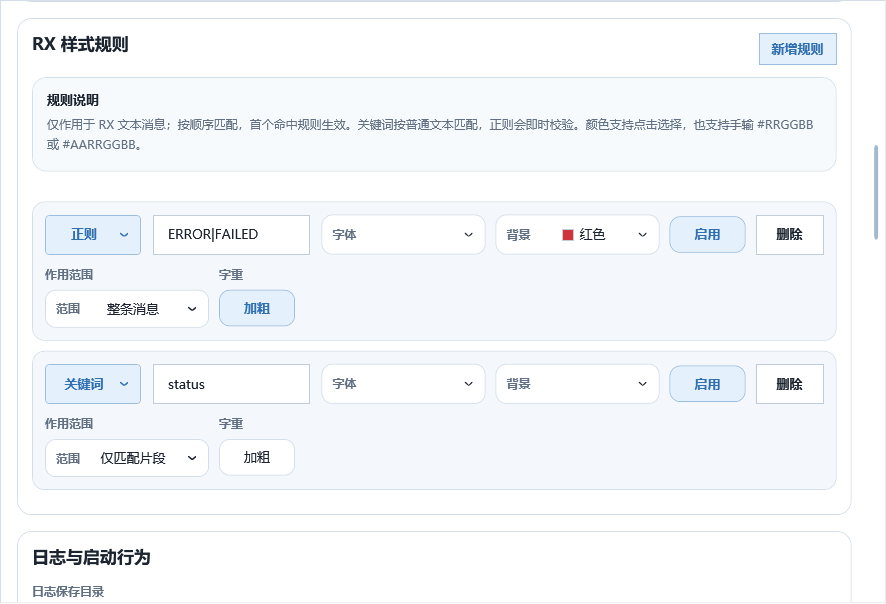

# cc串口助手

一个面向 Windows 的极简串口调试工具，适合日常收发、日志观察、搜索筛选、翻译查看和规则高亮。

欢迎讨论留言 后续会持续更新新的功能

## 运行依赖

- 包含依赖版：不需要额外安装 `.NET`，解压后可直接运行。
- 单文件版：需要先安装 `.NET 8 Desktop Runtime x64`。
- 串口设备如未正常识别，还需要安装对应的 USB 转串口驱动。

`.NET 8 Desktop Runtime x64` 官方下载：

- 下载页：[\(.NET 8 下载页\)](https://dotnet.microsoft.com/en-us/download/dotnet/8.0)
- 直接下载：[\(windowsdesktop-runtime-8.0.25-win-x64.exe\)](https://builds.dotnet.microsoft.com/dotnet/WindowsDesktop/8.0.25/windowsdesktop-runtime-8.0.25-win-x64.exe)

当前 README 记录的运行时版本说明：

- 版本：`.NET 8 Desktop Runtime 8.0.25`
- 架构：`x64`
- 发布日期：`2026-03-10`

## 发布包

当前发布版本：`v1.3.1`

- `单文件版 ccCOM-v1.3.1-win-x64-single-file.zip`
  说明：体积最小，便于分发；需要目标电脑先安装 `.NET 8 Desktop Runtime x64`。 
- `包含依赖版 ccCOM-v1.3.1-win-x64-self-contained.zip`
  说明：免安装，解压即用；不需要安装 .NET  运行。 

## 功能演示

- 主页极简
- 中键按住空白区移动窗口
- `Ctrl + 滚轮` 缩放窗口
- `Ctrl+B` 隐藏 / 显示快捷功能区
- `Ctrl+F` 搜索
- `Ctrl+H` 筛选
- `Ctrl+Y` 本地单词翻译
- 自定义规则高亮 `RX`

### 主页: 极简

消息区占主视角，底部只保留串口、波特率、换行、`HEX`、定时发送等常用控制。

### 搜索与筛选

| 搜索 | 筛选 |
| --- | --- |
|  |  |

- 搜索支持关键字、布尔表达式、大小写匹配、正则匹配。
- 筛选会实时收窄消息列表，便于只看状态、错误或指定字段。

### 翻译、隐藏快捷功能区、高亮规则

| 翻译词典 | 隐藏快捷功能区 |
| --- | --- |
|  |  |

| 自定义规则高亮 | RX 样式规则配置 |
| --- | --- |
|  |  |

- 本地翻译只影响显示，不改原始报文。
- 快捷功能区可以随时收起，保留更大的消息阅读空间。
- `RX` 样式规则支持关键词和正则，可对异常、状态等重点内容单独着色。
